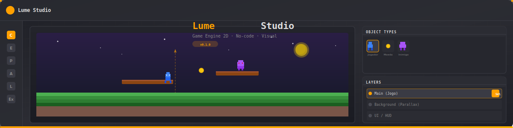

<div align="center">
  
  
  
</div>

<br />

<div align="center">
  
</div>

<h1 align="center">🎮 Lume Studio</h1>

<p align="center">
  <strong>Game engine 2D visual e sem código — 100% no navegador.</strong>
  <br />
  Crie jogos sem escrever código: editor de cenas, pixel art, eventos visuais, áudio chiptune, tilemaps, preview em tempo real e exportação HTML5.
</p>

<br />

---

## ✨ Funcionalidades

| Módulo | Descrição |
|---|---|
| **🎨 Editor de Cenas** | Canvas com zoom, snap, multi-seleção, camadas, instâncias, tilemaps (brush / flood fill / retângulo / borracha) |
| **🖌 Pixel Editor** | Desenhe sprites frame a frame com animações, paleta de cores, pincéis 1x1 a 4x4, balde de tinta |
| **📋 Eventos Visuais** | Sistema de eventos no-code com 28 tipos de condição e 40+ ações (Construct 3‑compatível) |
| **🎵 Áudio Chiptune** | Sintetizador de ondas (square, triangle, sawtooth, noise) com attack/decay/release, sequenciador de trilhas |
| **🧩 Comportamentos** | Platform, 8Direction, Bullet, Sine, Car, Physics, Pathfinding, Solid, Flash, Fade, Timer, Pin e mais — todos com parâmetros editáveis |
| **🗺 Tilemaps** | Múltiplas camadas de tile, definições visuais de tile (sólido/fluído), ferramentas de pintura |
| **📦 Biblioteca de Assets** | Sprites, sons e músicas pré-prontos para importar |
| **▶️ Preview ao Vivo** | Motor runtime que executa o jogo no navegador com física, colisão, eventos e animações |
| **📤 Exportação** | Gera HTML5 standalone + JSON do projeto |
| **↩️ Undo/Redo** | Histórico completo nos editores de cena e pixel |
| **📁 Templates** | 6 templates iniciais: Vazio, Plataforma, RPG, Puzzle, Arcade, Tabuleiro |

<br />

---

## 🖼 Visão Geral

```
┌─────────────────────────────────────────────────────────┐
│  ═══════════════════ TOP BAR ═════════════════════════  │
│  [C] Nome do Projeto  [Abrir] [Salvar] [Projeto] [▶]   │
├──────┬──────────────────────────────────┬───────────────┤
│      │                                  │  Object Types │
│  🏠  │       ┌──────────────────┐       │  ┌───┐ ┌───┐  │
│  📅  │       │                  │       │  │ J │ │ M │  │
│  ✨  │       │   Canvas 2D      │       │  └───┘ └───┘  │
│  🎵  │       │   com zoom e     │       │               │
│  📚  │       │   grid           │       │  Layers       │
│  📦  │       │                  │       │  ┌──────────┐ │
│      │       └──────────────────┘       │  │ Main     │ │
│      │                                  │  │ BG       │ │
│      │                                  │  │ UI       │ │
├──────┴──────────────────────────────────┴───────────────┤
│  ═══════════════════ STATUS BAR ═══════════════════════  │
└─────────────────────────────────────────────────────────┘
```

> *Layout inspirado no Construct 3, com tema escuro e acentos laranja.*

<br />

---

## 🚀 Como Usar

### Pré-requisitos

- **Node.js** 18+ (recomendado 20+)
- NPM (vem com Node.js)

### Instalação

```bash
# Clone o repositório
git clone https://github.com/seu-usuario/constructo-2d-studio.git
cd constructo-2d-studio

# Instale as dependências
npm install

# Inicie o servidor de desenvolvimento
npm run dev
```

Abra **http://localhost:5173** no navegador.

### Build para produção

```bash
npm run build
```

O resultado estará em `dist/` — pronto para deploy em qualquer servidor estático.

<br />

---

## 📖 Documentação de Uso

### 🏁 Primeiros Passos

1. **Tela de Boas-Vindas** — Ao abrir o estúdio, escolha um dos 6 templates ou crie um projeto vazio.
2. **Editor de Cenas** — Arraste objetos para o canvas, ajuste posição/tamanho/ângulo no painel lateral.
3. **Pixel Editor** — Edite sprites frame a frame, adicione animações e defina a velocidade.
4. **Eventos** — Crie lógica do jogo com condições e ações no estilo Construct 3.
5. **Preview** — Clique em ▶ **Preview** na barra superior para testar o jogo ao vivo.

### 🧱 Editor de Cenas

- **Ferramentas**: Selecione (Sel), Adicionar (Add), Mover — no topo do canvas.
- **Tilemap**: Ative o modo Tilemap para pintar tiles no cenário.
- **Camadas**: Crie, renomeie, reordene e toggle visibilidade no painel direito.
- **Objetos**: Botão direito em um tipo de objeto → `Editar` (Pixel Editor), `Clonar`, `Apagar`.
- **Instâncias**: Botão direito em uma instância no canvas → `Editar Propriedades`, `Clonar`, `Apagar`.
- **Atalhos**: `Delete/Backspace` remove instâncias selecionadas. `Ctrl+Z` desfaz, `Ctrl+Shift+Z` refaz.

### 🧩 Comportamentos

No painel de propriedades (selecionando uma instância), ative comportamentos como **Platform**, **8Direction**, **Bullet**, etc. Cada comportamento expõe parâmetros editáveis:

| Comportamento | Parâmetros |
|---|---|
| **Platform** | Velocidade, Força do Pulso, Gravidade, Aceleração, Desaceleração, Pulo Duplo |
| **8Direction** | Velocidade |
| **Bullet** | Velocidade, Gravidade |
| **Sine** | Amplitude, Período |
| **Car** | Velocidade Máx, Aceleração, Desaceleração, Giro, Derrapagem |
| **Flash / Fade / Timer** | Duração |
| **Physics** | Gravidade |
| **Pathfinding** | Velocidade |

### 📋 Sistema de Eventos

O editor de eventos oferece 28 tipos de condição e mais de 40 ações. Exemplos:

- **Condições**: Tecla pressionada, colisão entre objetos, variável comparada, toque na tela, a cada X segundos, sistema iniciou, etc.
- **Ações**: Mover objeto, destruir, criar instância, definir variável, tocar som, pular para cena, flash/fade, etc.

Para adicionar: clique em **+ Evento**, depois configure condições e ações nos blocos.

### 🎵 Áudio

Use o editor de áudio para criar:
- **Efeitos sonoros** (ondas square, triangle, sawtooth, noise)
- **Trilhas musicais** com sequenciador de notas, BPM, envelope ADSR

### 📤 Exportação

No módulo **Exportar**:
- **HTML5** — Gera um arquivo `.html` standalone com tudo embutido.
- **JSON** — Salva o projeto completo para backup ou compartilhamento.

<br />

---

## 🛠 Tecnologias

| Tecnologia | Uso |
|---|---|
| [React](https://react.dev) | Interface de usuário |
| [TypeScript](https://www.typescriptlang.org) | Tipagem estática |
| [Vite](https://vite.dev) | Bundler e dev server |
| [Tailwind CSS](https://tailwindcss.com) | Estilização utilitária |
| [Lucide Icons](https://lucide.dev) | Ícones |
| [HTML Canvas 2D](https://developer.mozilla.org/en-US/docs/Web/API/CanvasRenderingContext2D) | Renderização de cenas, sprites e tilemaps |
| [Web Audio API](https://developer.mozilla.org/en-US/docs/Web/API/Web_Audio_API) | Síntese de áudio chiptune |

<br />

---

## 📂 Estrutura do Projeto

```
src/
├── App.tsx                    # Raiz: navegação, estado global
├── types.ts                   # Todas as interfaces TypeScript
├── components/
│   ├── SceneEditor.tsx        # Editor de cenas (canvas, layers, tools)
│   ├── PixelEditor.tsx        # Editor de pixel art / sprite
│   ├── EventSheetEditor.tsx   # Editor de eventos visuais
│   ├── AudioEditor.tsx        # Sintetizador e sequenciador
│   ├── AssetLibrary.tsx       # Biblioteca de assets prontos
│   ├── Exporter.tsx           # Exportação HTML5 / JSON
│   ├── PreviewModal.tsx       # Preview ao vivo do jogo
│   ├── WelcomeScreen.tsx      # Tela inicial com templates
│   ├── ContextMenu.tsx        # Menu de contexto reutilizável
│   └── ProjectProperties.tsx  # Configurações globais do projeto
├── templates/
│   └── gameTemplates.ts       # 6 templates de projecto
├── utils/
│   └── engineRunner.ts        # Runtime engine (física, eventos, áudio)
└── main.tsx                   # Entry point
```

<br />

---

## 🤝 Contribuindo

Contribuições são bem-vindas! Sinta-se à vontade para abrir issues ou pull requests.

1. Faça um fork do projeto
2. Crie uma branch: `git checkout -b feature/minha-feature`
3. Commit suas mudanças: `git commit -m 'Adiciona nova funcionalidade'`
4. Push: `git push origin feature/minha-feature`
5. Abra um Pull Request

<br />

---

## 📄 Licença

Distribuído sob licença **Apache 2.0**. Veja [LICENSE](LICENSE) para mais informações.

<br />

---

<div align="center">
  <sub>Feito com ❤️ por <a href="https://github.com/manassesmartins">manassesmartins</a></sub>
  <br />
  <sub>Inspirado no <a href="https://www.construct.net">Construct 3</a> da Scirra Ltd.</sub>
</div>
